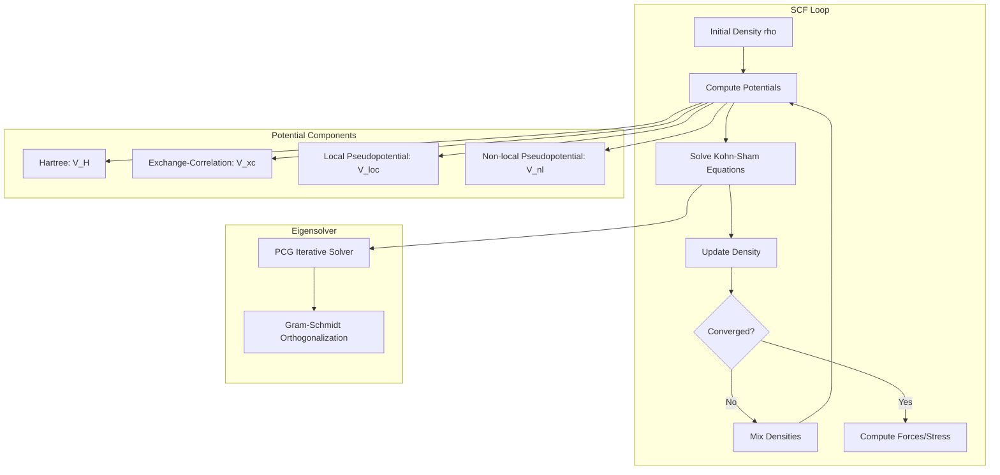

# DFT Documentation and Python Implementation Plan

## Overview

Create comprehensive documentation of the core DFT algorithms in dftworks and develop an educational Python implementation that demonstrates the fundamental concepts of plane-wave pseudopotential DFT.

## Code Analysis Summary

The dftworks codebase implements plane-wave pseudopotential DFT with:



## Core Algorithms Identified

### 1. Self-Consistent Field (SCF) Loop
- Location: [scf/src/nonspin.rs](scf/src/nonspin.rs)
- Algorithm: Iterative solution of Kohn-Sham equations until energy converges

### 2. Hartree Potential
- Location: [scf/src/hartree.rs](scf/src/hartree.rs)
- Formula: `V_H(G) = 4*pi * rho(G) / G^2`

### 3. Exchange-Correlation (LDA-PZ)
- Location: [xc/src/ldapz.rs](xc/src/ldapz.rs)
- Slater exchange: `vx = cx * rho^(1/3)`
- Perdew-Zunger correlation with rs-dependent parameterization

### 4. Preconditioned Conjugate Gradient Eigensolver
- Location: [eigensolver/src/pcg.rs](eigensolver/src/pcg.rs)
- Band-by-band optimization with Gram-Schmidt orthogonalization

### 5. Hamiltonian Application (H*psi)
- Location: [hpsi/src/lib.rs](hpsi/src/lib.rs)
- Kinetic: `T*psi = |k+G|^2 * psi(G)`
- Local: FFT-based convolution in real space
- Non-local: Kleinman-Bylander projectors

### 6. Density Mixing (Broyden)
- Location: [mixing/src/broyden.rs](mixing/src/broyden.rs)
- Modified Broyden method for SCF acceleration

### 7. Ewald Summation (Ion-Ion Energy)
- Location: [ewald/src/lib.rs](ewald/src/lib.rs)
- Real-space + G-space decomposition

### 8. Plane Wave Basis
- Location: [pwbasis/src/lib.rs](pwbasis/src/lib.rs)
- G-vectors with |k+G|^2 < E_cutoff

## Documentation Structure

Create `python_dft/` folder with:

1. **ALGORITHMS.md** - Detailed algorithm documentation
   - Mathematical foundations
   - Kohn-Sham equations
   - Each component algorithm with formulas
   - SCF workflow diagram

2. **README.md** - Overview and usage instructions

## Python Implementation Structure

Educational Python code in `python_dft/src/`:

```
python_dft/
├── README.md
├── ALGORITHMS.md
├── requirements.txt
└── src/
    ├── __init__.py
    ├── constants.py       # Physical constants
    ├── lattice.py         # Crystal lattice operations
    ├── gvector.py         # G-vector generation
    ├── pwbasis.py         # Plane wave basis set
    ├── xc.py              # LDA exchange-correlation
    ├── hartree.py         # Hartree potential
    ├── eigensolver.py     # PCG eigensolver
    ├── hamiltonian.py     # H*psi application
    ├── mixing.py          # Density mixing
    ├── scf.py             # SCF driver
    └── example.py         # Simple example (hydrogen atom in a box)
```

## Python Implementation Scope

Focus on clarity over performance:
- Use numpy for arrays and FFT
- Simple cubic lattice for demonstration
- Local potential only (no pseudopotentials)
- LDA exchange-correlation
- PCG eigensolver (simplified)
- Broyden mixing

## Key Simplifications

- Single k-point (Gamma only)
- No spin polarization
- No pseudopotentials (jellium or simple model potential)
- No symmetry
- No parallelization
